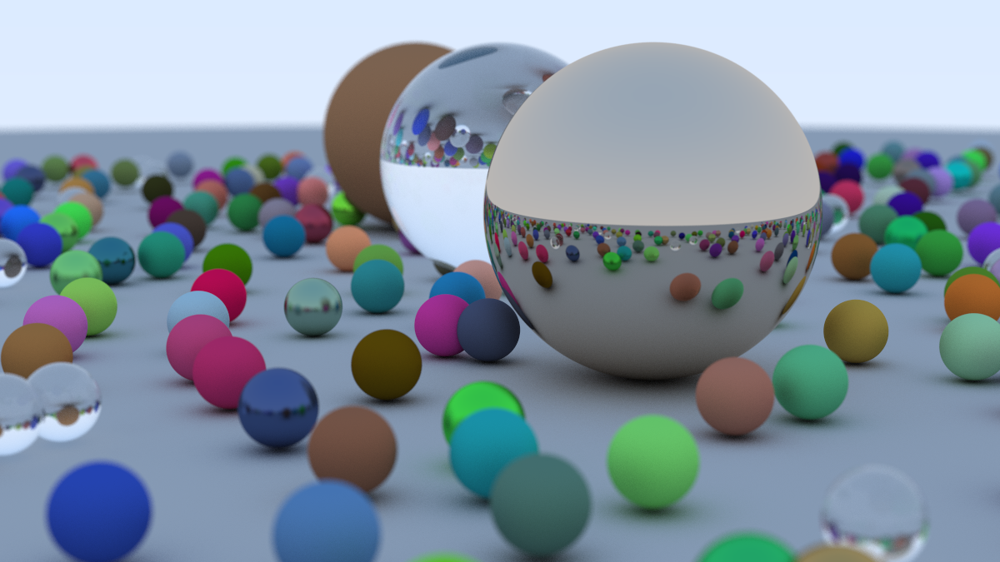
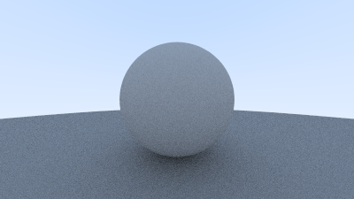
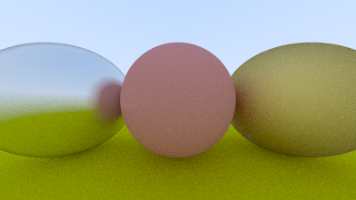
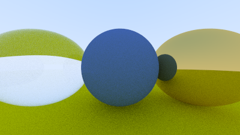
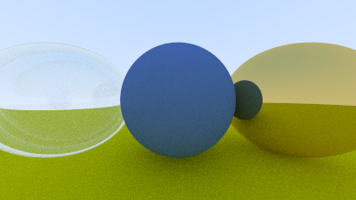
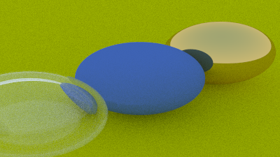
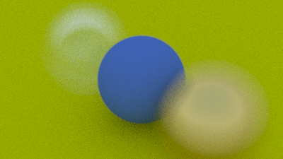

# Ray Tracing in One Weekend

Working through Peter Shirley [Ray Tracing in One Weekend](https://raytracing.github.io/books/RayTracingInOneWeekend.html)
in javascript.

 

Final image

  

  
Some of the other images rendered

    
    
    
    
    
    
    
